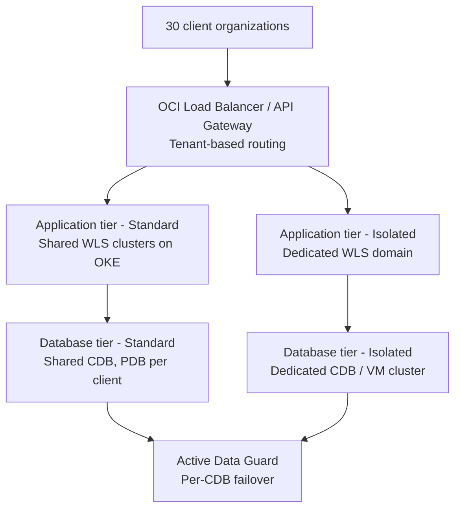

# From on-prem, per-client Oracle DB + WebLogic to a multi-tenant SaaS on OCI

## Context

For 15 years, this financial services application has been deployed as dedicated hardware in each of 30 client office locations, each running its own Oracle Database and WebLogic instance. The move to a SaaS offering means consolidating 30 separate deployments onto Oracle Cloud Infrastructure (OCI) without inheriting the operational cost of 30 standalone stacks, while still meeting the isolation requirements some financial services clients will have.

This article sketches a target architecture and the design decisions behind it.

## Architecture overview

The design splits both tiers into two paths rather than forcing all 30 clients into one pattern:

- **Standard tier** — shared, pooled infrastructure for clients without hard isolation requirements. Optimizes for density and operational simplicity.
- **Isolated tier** — dedicated infrastructure for clients who need it (regulatory requirements, independent DR posture, contractual isolation commitments — common in financial services).

Which clients land in which tier is a commercial and compliance decision as much as a technical one, and is worth settling early since it shapes network topology, backup/DR strategy, and the sizing of the shared pool.

## Database tier

**Target platform: Oracle Exadata Database Service on Exascale Infrastructure.** Exascale pools shared database-optimized compute and storage, letting you provision and scale just the DB storage and VM resources needed, starting small and scaling per client rather than sizing fixed Exadata shapes up front. It also supports fast, space-efficient thin clones of PDBs — useful both for onboarding new clients and for dev/test environments.

- **Standard tier**: PDB-per-client inside shared CDBs on the pooled Exascale infrastructure. Use CDB Resource Manager to allocate CPU/IO shares per PDB and PDB Lockdown Profiles to enforce tenant boundaries at the platform level.
- **Isolated tier**: dedicated CDB, or a dedicated Exadata VM Cluster for clients who need infrastructure-level separation.
- **DR**: Data Guard / Active Data Guard operates at the CDB level — one DG configuration protects every PDB in that CDB. This means DR posture is a per-CDB decision, not a per-PDB one. A client wanting an independent RPO/RTO is effectively a driver toward its own CDB.
- **Alternative to evaluate**: Autonomous Database on Dedicated Infrastructure offers the same PDB-based multitenancy with Oracle handling patching and tuning — attractive if the app doesn't rely on DB-level customizations accumulated over 15 years that would be harder to carry into Autonomous.
- **Open item**: confirm current multitenant/PDB licensing terms with the account's licensing team before finalizing PDB-per-CDB counts — this has changed over past releases and depends on the specific contract.

## Application tier

**Important constraint**: WebLogic Server's own Multi-Tenant feature (domain partitions) is deprecated. It is not a viable foundation for a new build, despite being the feature most associated with "WebLogic multitenancy."

**Target pattern: WebLogic Kubernetes Operator (WKO) on OCI Container Engine for Kubernetes (OKE).** The operator encapsulates a WebLogic installation and its applications into portable, cloud-neutral images and declarative resource definitions, and supports provisioning, lifecycle management, scaling, and patching through Kubernetes APIs.

- **Standard tier**: pooled/shared managed-server clusters, with a tenant-aware routing layer in front (subdomain or path-based) directing each client's traffic to the right cluster and — critically — the right JDBC data source, since each tenant's database is a separate PDB.
- **Isolated tier**: dedicated WebLogic domain/cluster (dedicated namespace or node pool) for clients requiring separation at the app tier too.
- **Traffic routing**: OCI Load Balancer or API Gateway in front, doing per-tenant routing before requests reach either tier.
- **Interim step**: if a full containerization is too large a first move, WebLogic Server for OCI (VM-based Marketplace stacks) is a reasonable stepping stone — still one domain/cluster per tenant tier, faster to stand up than 30 on-prem-style installs, and a path toward WKO/OKE later.

## Why this isn't purely an infrastructure exercise

Given the app's age, multitenancy touches application architecture as much as platform architecture: tenant isolation model, tenant-aware configuration and branding, and any metering/billing hooks needed for a SaaS commercial model. Worth having app architects in the design conversation alongside whoever owns the OCI infrastructure design.

## Open questions to resolve next

- Which of the 30 clients have hard (regulatory/contractual) isolation requirements vs. preference-driven ones?
- What's the actual DR/RPO/RTO commitment per client tier?
- Does the current schema/app design assume anything that breaks under PDB consolidation (e.g. hardcoded ports, file-system paths, or instance-specific config)?
- Confirm current Oracle Database multitenant licensing terms for the target PDB-per-CDB density.

## References

- [Oracle Exadata Database Service on Exascale Infrastructure overview](https://docs.oracle.com/en-us/iaas/exadb-xs/doc/overview-exadb-xs-service.html)
- [Using Oracle Multitenant on Exascale Infrastructure](https://docs.public.oneportal.content.oci.oraclecloud.com/en-us/iaas/exadb-xs/doc/exa-conf-db-features.html)
- [Using Oracle WebLogic Server Multitenant (Deprecated)](https://docs.oracle.com/en/middleware/fusion-middleware/weblogic-server/12.2.1.4/wlsmt/concepts.html)
- [WebLogic Kubernetes Operator](https://github.com/oracle/weblogic-kubernetes-operator)
